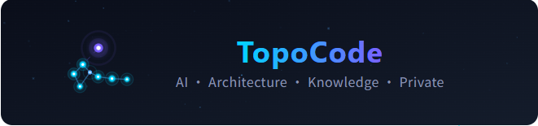

# TopoCode

> **中文** · [中文](README.md)

<p align="center">
  <picture>
    <source srcset="assets/star-logo-en.svg" type="image/svg+xml">
    
  </picture>
</p>

> Source Code Architecture Deep Analysis Tool — An "analysis microscope" for "deep code learning" that elevates your architectural cognition.

TopoCode is not a one-shot efficiency tool that generates architecture diagrams from a single prompt. It is a platform that helps you understand project architecture **layer by layer and improve your architectural cognition**. Through static code parsing, dependency graph computation, community detection algorithms, and AI-assisted analysis, it uncovers the design logic and module relationships behind the code — helping developers truly understand the architecture of unfamiliar projects.

---

> **Privacy Notice**: Except for user-configured cloud LLM APIs, all features of TopoCode — code parsing, graph computing, architecture analysis, web document service, etc. — run **locally**. Your project source code and analysis data are never uploaded to any external server, ensuring your data privacy and security.

## Features

- **Project Import & Management** — Local directory import, file tree browsing, group management
- **Multi-language Code Parsing** — Tree-sitter based AST parsing supporting 18+ programming languages
- **Architecture Visualization** — Dependency/Call/Community structure graphs (D3.js / Cytoscape) with interactive browsing
- **Community Detection** — Louvain / Leiden algorithms for automatic code module (community) identification
- **AI Architecture Analysis** — LLM-powered workflows that automatically analyze component functions and generate architecture overview documents
- **Interactive AI Assistant** — Context-aware Q&A with tool-calling capabilities (symbol search, file reading, etc.), accessible via the local web port in any browser
- **Knowledge Base** — Persistent storage of analysis documents (categorization pending). A key focus for future iterations — the goal is to evolve into an **external brain** that aligns with your cognition. Beyond static storage, it will support multiple integration methods to command other agent tools, closing the loop of **store → analyze → use**
- **Web Document Service & AI Chat** — Local HTTP server (default port 3456) for browsing architecture documents and using the AI assistant in a browser
- **Internationalization** — Chinese / English interface and AI analysis output

> **Note — projects with code generation**: TopoCode parses source files directly from disk and does not require a full build environment. If your project has code generation steps (e.g., protobuf, graphql-codegen, `go generate`, etc.), the generated sources are not part of the original code and won't be included in analysis by default. **For a more comprehensive analysis**, you may run the code generation commands before importing. Analyze based on your needs — covering every generated file is not necessary.
>
> Common code generation command examples:
>
> | Language | Typical Codegen Scenario | May Run Before Import |
> |---|---|---|
> | C / C++ | autoconf config.h / yacc / bison / flex / Qt MOC / protobuf | `./configure` / `bison -d parser.y` / `moc header.h` / `protoc --cpp_out=.` |
> | Go | stringer / mockgen / protobuf | `go generate ./...` / `protoc --go_out=.` |
> | TypeScript | graphql-codegen / protobuf-ts / openapi-generator | `npx graphql-codegen` / `protoc --ts_out=.` |
> | Dart | freezed / json_serializable / drift / protobuf | `dart run build_runner build` / `protoc --dart_out=.` |
> | Java | protobuf / Dagger / MapStruct annotation processors | `protoc --java_out=.` |
> | Kotlin | protobuf / KSP | `protoc --kotlin_out=.` |
> | Swift | protobuf / Sourcery | `protoc --swift_out=.` / `sourcery --sources ...` |
> | C# | protobuf / T4 templates | `protoc --csharp_out=.` |
> | Python | protobuf / Cython | `protoc --python_out=.` |
> | Other | protobuf / thrift / gRPC codegen for any language | Corresponding codegen command |

---

## Tech Stack

| Layer | Technology |
|---|---|
| **Frontend** | Vue 3 + TypeScript + Pinia + Vue Router |
| **UI Styling** | Tailwind CSS + SCSS + Heroicons |
| **Visualization** | D3.js + Cytoscape + Mermaid + PlantUML + PixiJS |
| **Desktop** | Electron + electron-builder |
| **Backend** | Python 3.10+ |
| **IPC** | ZeroMQ (pyzmq) |
| **Code Parsing** | Tree-sitter (18+ languages) |
| **Graph Computing** | NetworkX + python-louvain + leidenalg + python-igraph |
| **Web Server** | FastAPI + Uvicorn |
| **AI Inference** | OpenAI / Ollama / LM Studio compatible |
| **Database** | SQLite + DuckDB |

---

## Language Settings

TopoCode supports **Chinese** and **English** interfaces. To switch the language:

1. Open **Settings** (gear icon in the bottom-left corner)
2. Go to **General Settings**
3. Select your preferred language under the **Language** section
4. The interface language updates immediately

The AI analysis output language can be configured independently under **Settings → General Settings → AI Analysis Language**.

---

## Usage Guide

For a detailed walkthrough, please refer to:
- [English Usage Guide](docs/usage-guide-en.md)
- [中文使用教程](docs/usage-guide-zh.md)

---

## Project Structure

```
topoOne-ui/
├── src/                          # Vue 3 Frontend
│   ├── components/               # UI Components
│   │   ├── ai/                   # AI Assistant Panel
│   │   ├── analysis/             # Analysis Tasks
│   │   ├── knowledge/            # Knowledge Base
│   │   ├── project/              # Project Management
│   │   ├── report/               # Architecture Reports
│   │   ├── settings/             # Settings Pages
│   │   ├── shell/                # App Shell (ActivityBar, TopBar, StatusBar)
│   │   └── visualization/        # Visualization Components
│   ├── composables/              # Vue Composables
│   ├── pages/                    # Route Pages
│   ├── router/                   # Route Configuration
│   ├── services/                 # IPC Services (ZeroMQ calls)
│   ├── stores/                   # Pinia State Management
│   ├── i18n/                     # Internationalization (zh-CN / en-US)
│   └── types/                    # TypeScript Type Definitions
├── electron/                     # Electron Main Process
│   ├── main.ts                   # Main entry + IPC handler
│   ├── preload.ts                # contextBridge security bridge
│   ├── window-manager.ts         # Multi-window management
│   ├── python-bridge.ts          # Python backend process management
│   ├── zmq-router.ts             # ZeroMQ message routing
│   └── updater.ts                # Auto-updater
├── backend-core/                 # Python Backend
│   ├── main.py                   # Backend entry (monolith / distributed)
│   ├── zmq_server.py             # ZeroMQ RPC server
│   ├── core_service.py           # Core business method registration
│   ├── llm_service.py            # LLM inference service
│   ├── task_manager.py           # Analysis task manager
│   ├── sqlite_ctx.py             # SQLite multi-database management
│   ├── agent_workflow/           # AI Agent Workflows
│   │   ├── workflows/            # Predefined workflows (overview, component, etc.)
│   │   ├── toolkits/             # Tool sets (file, symbol, graph)
│   │   └── runtime.py            # Agent runtime
│   ├── prompt_manager.py         # Prompt template management
│   ├── providers/                # LLM provider adapters (OpenAI, Ollama)
│   ├── messaging/                # Internal message bus
│   ├── ingest/                   # Data ingest pipeline
│   ├── data_layer/               # Data access layer (cache, duckdb)
│   └── store/                    # Persistent storage
├── plugins/                      # Plugin System
│   ├── parsers/                  # Code parsers (Tree-sitter)
│   ├── community/                # Community detection algorithms
│   ├── reports/                  # Web document service (FastAPI)
│   └── installer/                # AI coding tool installer
├── build/                        # Build scripts
├── scripts/                      # Dev/debug scripts
└── tests/                        # Unit tests
```

---

## Recommended Environment

- **CPU**: 4+ cores
- **RAM**: 16 GB or more
- **OS**: Linux / macOS / Windows (physical or VM)
- **Storage**: At least 10 GB free space (for parsed data and knowledge base)

> **Local model hardware requirements**: Running local models like Qwen3.6-9B-Q4 (quantized) requires **NVIDIA RTX 4060 Ti 16 GB or above**. Without a dedicated GPU, local models will fall back to CPU inference, which is significantly slower. If using only cloud models (e.g., DeepSeek V4 Flash), 4-core / 8 GB RAM is sufficient for basic usage.

> **GUI runtime notice**: This application includes Electron GUI components. When running on a headless VM, cloud server, or command-line-only system without a desktop environment, you must manually install a virtual display service for graphics rendering. Physical machines or systems with an existing desktop environment require no additional setup.

### Environment & Virtual Display Reference

| System Environment | Desktop | Required Action | Install Command |
|---|---|---|---|
| Physical machine / Workstation (Windows / macOS / Linux Desktop) | Pre-installed | None | — |
| Linux Server (Ubuntu / Debian) | None | Install xvfb | `sudo apt install xvfb` |
| Linux Server (CentOS / RHEL / Fedora) | None | Install Xvfb | `sudo yum install xorg-x11-server-Xvfb` |
| Cloud Server / VM (headless) | None | Install xvfb | Same as above, choose based on distro |
| WSL 1/2 | None | Install VcXsrv + configure DISPLAY | Install VcXsrv on Windows, run `export DISPLAY=:0` in WSL |
| Docker Container | None | Use xvfb-run | `xvfb-run npm run dev` |

### LLM Analysis Time Estimates

Architecture analysis duration depends on **codebase size**, **LLM performance**, and **concurrency settings**. Typical estimates (single concurrency, 50 tokens/s):

| Phase | Est. Time | Notes |
|---|---|---|
| **Syntax Parsing + Component Relationship Analysis** | 2–5 min | Static analysis, no LLM required |
| **5,000 Source Files Analysis** | 10–20 min | File traversal and basic metadata extraction |
| **File Pre-summary** | ~1 min / file | Hundreds of files may take hours; LLM-intensive |
| **Component Analysis** | 1–5 min / component | Depends on component size, multi-turn LLM dialogue |
| **Overall Architecture Generation** | 1–5 min | Synthesizes summaries into architecture overview |

> **Tip**: Create an account and visit **User Center → Resource Center** to download pre-analyzed architecture content. The resource center is updated regularly with popular projects — saving you local processing time.

## Prerequisites

- **Node.js** >= 20.0.0
- **Python** >= 3.10
- **npm** or **pnpm**
- **pip**

## Quick Start

### 1. Install Frontend Dependencies

```bash
# Single command, no environment variable pollution
npm install

# Use mirror registry in China (one-shot, no config changes):
# ELECTRON_MIRROR="https://npmmirror.com/mirrors/electron/" \
#   npm install --registry=https://registry.npmmirror.com

# Or use pnpm (faster, no global install required):
# npx pnpm install
```

### 2. Create Python Virtual Environment & Install Dependencies

> `npm run dev` will automatically detect a virtual environment (`.venv/` or `venv/`) in the project root and prefer its Python interpreter.

```bash
# Single command — creates venv, installs deps, no global pollution
python3 -m venv .venv && \
  source .venv/bin/activate && \
  cd backend-core && \
  pip install -r requirements.txt

# Windows PowerShell:
# python3 -m venv .venv; `
#   .venv\Scripts\Activate.ps1; `
#   cd backend-core; `
#   pip install -r requirements.txt

# Use mirror in China (replace the pip line above):
#   pip install -r requirements.txt \
#     -i https://pypi.tuna.tsinghua.edu.cn/simple \
#     --trusted-host pypi.tuna.tsinghua.edu.cn
```

### 3. Run in Development Mode

```bash
# Start Vite dev server + Electron
npm run dev

# Vite dev server only (browser development)
npm run dev:vite

# Debug mode (verbose logging)
npm run dev:debug
```

The Python backend will start automatically on first launch. Frontend URL: `http://localhost:5173`

### 4. Build for Production

```bash
npm run build

# Package as desktop application
npm run dist:linux   # Linux
npm run dist:win     # Windows
npm run dist:mac     # macOS
npm run dist:all     # All platforms
```

---

## LLM Configuration

After launching, go to **Settings → Model Config** to add an LLM model. Any provider compatible with the OpenAI API format is supported.

### Model Recommendations

| Purpose | Recommendation | Notes |
|---|---|---|
| **Architecture Analysis (Agent Workflow)** | Local model: Qwen3.6-9B or above (Ollama / LM Studio) | Architecture analysis consumes significant tokens due to multi-turn tool calls and file summarization. **Local deployment recommended** for cost savings and response speed |
| **AI Chat** | Cloud model, e.g. **DeepSeek V4 Flash** | Interactive chat benefits from stronger models. DeepSeek V4 Flash offers excellent value. GPT-4o / Claude also supported |

### Common Configurations

- **Ollama (local)**: `http://localhost:11434`
- **OpenAI-protocol compatible** (any service supporting the OpenAI API format, e.g. DeepSeek, Qwen, etc.): `https://api.openai.com`
- **DeepSeek**: `https://api.deepseek.com`
- **LM Studio**: `http://localhost:1234`

---

## Web Document Service & AI Chat

When the application is running, **both the AI assistant interface and document browsing are served through the local web service**, which listens on `http://localhost:3456` by default:

- `/` — Project document home
- `/doc` — Document viewer (with Mermaid / PlantUML rendering)
- `/chat` — AI chat interface (use the AI assistant directly in a browser, no Electron needed)

The HTTP port and bind address can be changed in **Settings → General Settings**.

---

## Development

```bash
# Code quality
npm run type-check    # TypeScript type checking
npm run lint          # ESLint code style

# Tests
npm run test                          # Frontend tests
cd backend-core && python -m pytest   # Backend tests
```

---

## License

[Apache License 2.0](LICENSE)

---

## Contact

- Developer Email: **topocode@163.com**
- Project Homepage: [https://github.com/topocode/topoone-ui](https://github.com/topocode/topoone-ui)
- Issues: [https://github.com/topocode/topoone-ui/issues](https://github.com/topocode/topoone-ui/issues)
