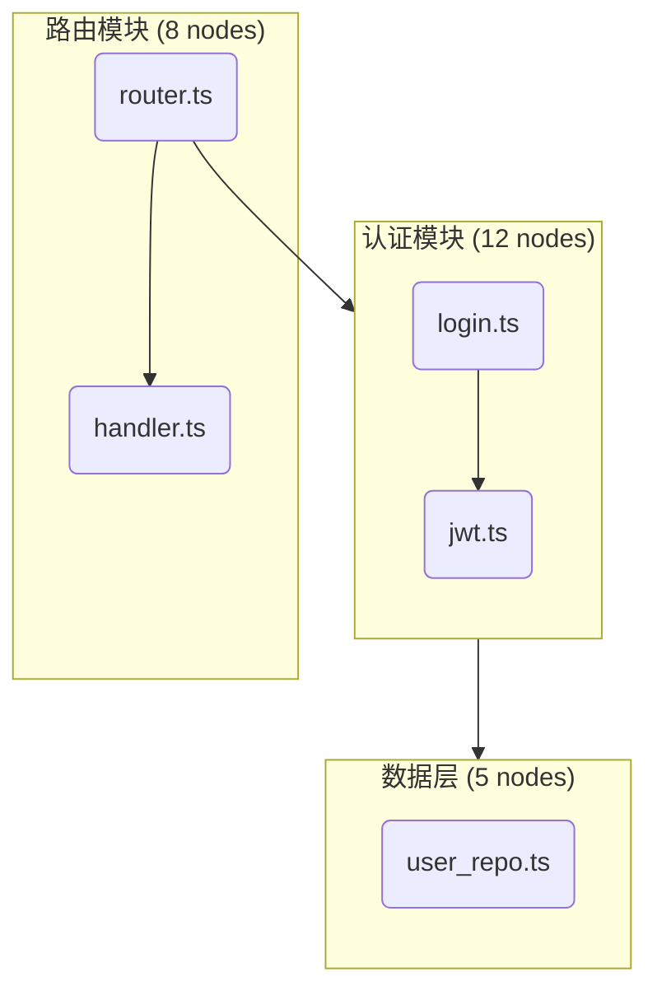
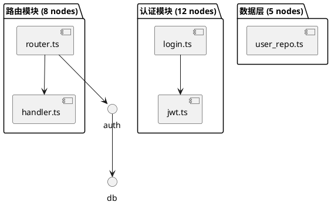

# Mermaid & PlantUML 生成工具 — 设计方案

> 日期：2026-06-22
> 状态：讨论稿，待决策

---

## 一、现状分析

### 已有的图相关能力

| 组件 | 位置 | 说明 |
|------|------|------|
| `_GenerateDiagramTool` + `_build_mermaid()` / `_build_plantuml()` | `arch_analyst.py:96-259` | 模板化的单社区子图生成，硬编码 `graph TD` 布局，功能有限 |
| `skill_fix_mermaid` / `skill_fix_plantuml` | `skills.py:63-87` | **修正已有图代码**（独立于生成，不依赖 LLM 的语法校验） |
| `skill_fix_diagram` | `skills.py:89-103` | 通用图修复：validate → auto-fix（最多重试 2 轮） |
| `AnalysisContext` | `analysis_context.py` | 四层认知模型，支持社区/文件/符号层级查询 |
| `SymbolGraph` (NetworkX) | `symbol_graph.py` | 图数据结构，支持 BFS 邻域遍历、子图提取 |
| `graph_node` / `graph_edge` / `graph_doc` 表 | `analysis_store.py` | 符号/边/社区的全量数据 |
| `community_llm_results` 表 | `analysis_store.py:637` | LLM 生成的社区命名和摘要 |
| 前端 MermaidViewer / PlantUMLViewer | `src/components/report/` | 渲染 Mermaid/PlantUML 文本到图形 |
| Prompt 模板 `community_analyze` | `config/prompt_templates.json` | 社区分析时 LLM 同时输出 mermaid + plantuml |

### 当前方案的局限性

```
_GenerateDiagramTool 的问题：
  ├─ 只接受外部传入 dict，不能直接从 DB 查询
  ├─ 只支持 community subgraph 一种图模式
  ├─ 单模板（graph TD），不考虑布局优化
  ├─ 无节点上限控制，大社区可能生成数千行
  ├─ 只在 ArchAnalystWorkflow 内可用（被 workflow 编排）
  ├─ 对外部 Agent（通过 MCP）完全不可见
  └─ llm_visible=False，无法被 LLM function calling 自主调用
```

---

## 二、目标

设计一个统一的图生成工具，满足：

1. **多图类型** — 架构总览、社区详情、调用链、依赖流向、依赖矩阵
2. **多入口** — TopoCode 内部 Agent Tool + 外部 Agent MCP 工具
3. **数据驱动** — 直接从 codegraph DB 查询，不依赖上游调用传 dict
4. **智能约束** — 自动控制节点数、按度中心性采样、层级折叠
5. **可组合** — 生成后可通过 `skill_fix_mermaid` / `skill_fix_plantuml` 自动修正
6. **向后兼容** — 替换现有 `_GenerateDiagramTool`，保持 `name="generate_diagram"`，对 ArchAnalystWorkflow 透明

---

## 三、架构设计

```
┌──────────────────────┐   ┌──────────────────────┐
│   MCP Tool           │   │   Agent Tool          │
│   topocode_diagram   │   │   generate_diagram    │
│   (外部 Agent 调用)   │   │   (内部 Agent 调用)    │
└────────┬─────────────┘   └──────────┬────────────┘
         │                            │
         └──────────┬─────────────────┘
                    │
         ┌──────────▼──────────────────────┐
         │     diagram/engine.py           │
         │     DiagramEngine               │
         │                                  │
         │   1. 解析参数（type, format, ...） │
         │   2. 查询所需数据                  │
         │   3. 按 type 分发给对应 Layout     │
         │   4. 调用 Renderer 输出文本         │
         └──────┬───────────────────────────┘
                │
     ┌──────────┼─────────────┬──────────────┐
     ▼          ▼             ▼              ▼
┌─────────┐┌─────────┐ ┌──────────┐ ┌──────────────┐
│ layouts/││layouts/ │ │layouts/  │ │ renderers/    │
│arch.py  ││comm.py  │ │callgraph │ │ mermaid.py    │
│         ││         │ │.py       │ │ plantuml.py   │
│ 架构总览 ││ 社区细节 │ │ 调用链    │ │               │
│ 布局策略 ││ 布局策略 │ │ 布局策略  │ │ 文本生成器     │
└─────────┘└─────────┘ └──────────┘ └──────────────┘
                │
                ▼
         ┌──────────────┐
         │ 原始数据来源   │
         │               │
         │• AnalysisStore│
         │• SymbolGraph  │
         │• AnalysisCtx  │
         └──────────────┘
```

### 模块结构

```
backend-core/diagram/
├── __init__.py              # export DiagramEngine
├── engine.py                # DiagramEngine 入口类
├── models.py                # 统一数据模型（Node, Edge, Graph, Community）
├── providers/               # 数据提供者（从 DB 查询）
│   ├── community.py         # community_* 查询
│   ├── symbol.py            # symbol/call-chain 查询
│   └── file.py              # file/dependency 查询
├── layouts/                 # 布局策略
│   ├── base.py              # LayoutStrategy 抽象基类
│   ├── arch_overview.py     # 架构总览布局
│   ├── community_detail.py  # 社区细节布局
│   ├── call_graph.py        # 调用链布局
│   ├── dependency_flow.py   # 依赖流向布局
│   └── matrix.py            # 依赖矩阵布局
├── renderers/               # 输出渲染器
│   ├── base.py              # Renderer 抽象基类
│   ├── mermaid.py           # → Mermaid 文本
│   └── plantuml.py          # → PlantUML 文本
└── agent_tool.py            # Agent Tool 封装（llm_visible=True）
```

---

## 四、图类型定义

### 类型 1：`arch_overview` — 架构总览

**目标**：展示全项目的 L0 社区结构 + 社区间依赖/调用关系

```
输入：所有 L0 社区 + 社区间边
输出：Mermaid subgraph 嵌套图 / PlantUML package 图
布局：每个 L0 社区 = subgraph，社区间边 = cross-subgraph 箭头
      社区内节点用社区 AI 命名作为 label
      按社区内节点数降序排列
```

示例 Mermaid 输出：



示例 PlantUML 输出：



### 类型 2：`community_detail` — 社区细节

**目标**：展示单个社区内的子社区/文件/符号结构，递归嵌套展示层级

```
输入：community_id, depth, max_nodes
输出：嵌套 subgraph 图 / PlantUML 多层 package 图
布局：利用社区层级结构（L0→L1→L2），逐层嵌套
      Hub 节点（高 degree）标注特殊颜色/形状
      文件节点用文件名，符号节点用符号名
```

### 类型 3：`call_graph` — 调用链

**目标**：展示两个符号之间的调用链路，或某个符号的调用者/被调用者网络

```
输入：source, target（可选）, direction, max_nodes
输出：LR 流向图
布局：利用 SymbolGraph.neighbors() BFS 遍历
      source 在左/中，逐层向右展开
      环路标注红色虚线
      direction = upstream / downstream / both
```

### 类型 4：`dependency_flow` — 依赖流向

**目标**：展示某个社区或文件的上游依赖和下游被依赖

```
输入：source, direction, max_nodes
输出：LR 流向图
布局：source 居中，上游在左，下游在右
      社区级显示社区名，文件级显示文件名
```

### 类型 5：`matrix` — 依赖矩阵

**目标**：以矩阵形式展示社区间依赖，适合快速识别循环依赖

```
输入：edge_type
输出：PlantUML 矩阵图 或 Mermaid 表格

       ROUTE AUTH  DB  CACHE
ROUTE   -     ✓    ✗    ✗
AUTH    ✗     -    ✓    ✓
DB      ✗     ✗    -    ✗
CACHE   ✗     ✗    ✓    -
```

---

## 五、关键设计细节

### 5.1 数据查询层（providers/）

从现有的 `AnalysisStore` / `AnalysisContext` 查询，不重复连接 DB：

```python
class CommunityProvider:
    def __init__(self, store: AnalysisStore, task_id: str, ctx: AnalysisContext):
        self._store = store
        self._task_id = task_id
        self._ctx = ctx

    def get_l0_communities(self, edge_type="INCLUDE") -> list[dict]:
        return self._store.get_communities(self._task_id, edge_type=edge_type, comm_lv="L0")

    def get_community_children(self, comm_id: str, depth=2) -> list[dict]:
        """递归查社区子层级"""

    def get_community_name(self, comm_id: str) -> str:
        """从 community_llm_results 获取命名"""
```

### 5.2 智能节点限制

大图自动采样策略：

```
超过 max_nodes（默认 30）时:
  1. 按 degree（出度+入度）排序所有节点
  2. 保留 top-N 个高 degree 节点
  3. 被删除节点的边合并到所属社区级聚合边
  4. 输出末尾标注："图已压缩：原始 85 个节点 → 显示 30 个核心节点"
```

### 5.3 与现有 `skill_fix_mermaid` / `skill_fix_plantuml` 的组合

```
Agent 调用流程：

  1. generate_diagram(type="community_detail", comm_id="L0-0003")
     → 返回 Mermaid 文本

  2. 可选的后续步骤（用户/Agent 决定是否需要）：
     skill_fix_mermaid(code=result)
     → 验证语法 + 自动修正 + 输出最终文本
```

`skill_fix_mermaid` 和 `skill_fix_plantuml` 已存在且独立，不修改。新工具的生成 + 已有的修复能力形成完整链路。

### 5.4 向后兼容

现有的 `_GenerateDiagramTool`（`arch_analyst.py`）内部改为调用新引擎，保持 `name="generate_diagram"` 和 `category="visualization"` 不变，对 `ArchAnalystWorkflow` 透明：

```python
class _GenerateDiagramTool(AgentTool):
    name = "generate_diagram"     # 不变
    category = "visualization"    # 不变

    async def execute(self, community, child_communities=None, edges=None, **kwargs):
        # 旧接口：传入 dict → 新引擎
        engine = DiagramEngine(store, task_id, ctx)
        result = engine.render(
            type="community_detail",
            community_id=comm_id,
            format="both",
            max_nodes=30,
        )
        return ToolResult.ok(data=result.data)
```

### 5.5 MCP 工具定义

```python
TOPocode_DIAGRAM = ToolDefinition(
    name="topocode_diagram",
    description=(
        "生成架构图（Mermaid / PlantUML 文本）。"
        "支持 5 种模式：arch_overview（架构总览）、"
        "community_detail（社区细节）、call_graph（调用链）、"
        "dependency_flow（依赖流向）、matrix（依赖矩阵）。"
        "利用代码分析结果智能布局，超节点自动采样。"
    ),
    inputSchema={
        "type": "object",
        "properties": {
            "type": {
                "type": "string",
                "enum": ["arch_overview", "community_detail",
                         "call_graph", "dependency_flow", "matrix"],
                "description": "图的类型",
            },
            "format": {
                "type": "string",
                "enum": ["mermaid", "plantuml"],
                "default": "mermaid",
            },
            "community_id": {
                "type": "string",
                "description": "社区 ID（community_detail 类型需要）",
            },
            "source": {
                "type": "string",
                "description": "起始节点（call_graph / dependency_flow 需要）",
            },
            "target": {
                "type": "string",
                "description": "目标节点（call_graph 可选）",
            },
            "edge_type": {
                "type": "string",
                "enum": ["INCLUDE", "CALL"],
                "default": "INCLUDE",
            },
            "depth": {
                "type": "integer",
                "default": 1,
                "description": "展开深度",
            },
            "direction": {
                "type": "string",
                "enum": ["upstream", "downstream", "both"],
                "default": "both",
                "description": "方向（call_graph / dependency_flow 使用）",
            },
            "max_nodes": {
                "type": "integer",
                "default": 30,
                "description": "最大节点数，超出的自动按度中心性采样",
            },
            "highlight": {
                "type": "array",
                "items": {"type": "string"},
                "description": "高亮节点列表（可选）",
            },
        },
        "required": ["type"],
    },
)
```

### 5.6 Agent Tool 定义

```python
class GenerateDiagramTool(AgentTool):
    name = "generate_diagram"
    description = "基于架构分析数据生成 Mermaid/PlantUML 架构图"
    category = "visualization"
    llm_visible = True  # 可被 LLM function calling 自主调用

    def __init__(self, project_db, task_id):
        self._store = AnalysisStore(project_db)
        self._ctx = AnalysisContext(project_db, task_id)

    def to_openai_schema(self) -> dict:
        return {
            "type": "function",
            "function": {
                "name": "generate_diagram",
                "description": self.description,
                "parameters": {
                    "type": "object",
                    "properties": {
                        "type": {"type": "string", "enum": [
                            "arch_overview", "community_detail",
                            "call_graph", "dependency_flow", "matrix",
                        ]},
                        "format": {"type": "string", "enum": ["mermaid", "plantuml"], "default": "mermaid"},
                        "community_id": {"type": "string"},
                        "source": {"type": "string"},
                        "target": {"type": "string"},
                        "max_nodes": {"type": "integer", "default": 30},
                    },
                    "required": ["type"],
                },
            },
        }

    async def execute(self, **kwargs) -> ToolResult:
        engine = DiagramEngine(self._store, self._ctx)
        return await engine.render(**kwargs)
```

### 5.7 注册到工具工厂

```python
# tool_factory.py
def build_diagram_tools(project_db, task_id) -> ToolRegistry:
    from diagram.agent_tool import GenerateDiagramTool
    tools = ToolRegistry()
    tools.register(GenerateDiagramTool(project_db, task_id))
    return tools
```

路由可选择性注入到 Agent Runtime：

```python
# router.py — 新增路由
router.register("generate_diagram", RouteEntry(
    workflow_class=SingleToolWorkflow,  # 单工具工作流
    tool_builder=lambda: build_diagram_tools(project_db, task_id),
    description="按需生成架构图",
))
```

---

## 六、与现有系统的集成点

| 现有组件 | 集成方式 |
|---------|---------|
| `AnalysisStore` | providers/ 通过 `get_communities()`、`get_graph_nodes()`、`get_graph_edges()` 查询原始数据 |
| `AnalysisContext` | 社区层级查询、四层认知描述（what/how/why 可作为图节点的 tooltip/label） |
| `SymbolGraph` (NetworkX) | `call_graph` 布局利用 `neighbors()` BFS 遍历，`subgraph()` 提取子图 |
| `community_llm_results` | 作为社区 label/name 的主要来源 |
| `ArchAnalystWorkflow._GenerateDiagramTool` | 内部改为调用新 engine，保持接口不变 |
| `skill_fix_mermaid` / `skill_fix_plantuml` | 生成后可组合调用，作为后处理验证/修正步骤 |
| 前端 MermaidViewer / PlantUMLViewer | MCP 和 Agent Tool 都只输出文本，前端直接渲染 |

---

## 七、与现有 `_build_mermaid` / `_build_plantuml` 对比

| 维度 | 现有（arch_analyst.py） | 新方案 |
|------|------------------------|--------|
| 图类型 | 仅 community subgraph | 5 种（总览/详情/调用链/依赖流/矩阵） |
| 数据来源 | 外部传入 dict | 自动从 DB 查询 |
| 节点上限 | 无限制（大社区可能数千行） | 可配 smart sampling（默认 30） |
| 布局策略 | 硬编码 `graph TD` | 按图类型选择最优布局 |
| 分层展示 | 仅 subgraph 一层 | 支持 L0→L1→L2 递归嵌套 |
| 着色/样式 | 无 | Hub 节点高亮、环路标注 |
| 外部可调 | ❌ 仅内部 workflow | ✅ MCP Tool + Agent Tool |
| 可组合 | ❌ 独立使用 | ✅ 可与 skill_fix_* 串联 |
| LLM 可见 | ❌ llm_visible=False | ✅ llm_visible=True |
| 代码结构 | 模板字符串硬编码（~40 行） | 模块化 layouts/ + renderers/（~800 行） |

---

## 八、实现路线

| 步骤 | 内容 | 估计 |
|------|------|------|
| 1 | 创建 `diagram/` 包 + `models.py` + `__init__.py` | ~80 行 |
| 2 | 实现 `renderers/base.py` 渲染器抽象基类 | ~30 行 |
| 3 | 实现 `renderers/mermaid.py`（subgraph, style, link, classDef 等） | ~200 行 |
| 4 | 实现 `renderers/plantuml.py`（component, package, skinparam 等） | ~200 行 |
| 5 | 实现 `providers/community.py` + `providers/symbol.py` | ~120 行 |
| 6 | 实现 `layouts/arch_overview.py` — 全项目架构总览 | ~150 行 |
| 7 | 实现 `layouts/community_detail.py` — 单社区递归嵌套 | ~150 行 |
| 8 | 实现 `layouts/call_graph.py` — 基于 SymbolGraph BFS | ~200 行 |
| 9 | 实现 `layouts/dependency_flow.py` + `layouts/matrix.py` | ~150 行 |
| 10 | 实现 `layouts/base.py` LayoutStrategy 基类 + 引擎入口 | ~150 行 |
| 11 | 实现 `engine.py` — DiagramEngine 主入口 + 智能采样 | ~150 行 |
| 12 | 实现 `agent_tool.py` — AgentTool 封装 | ~100 行 |
| 13 | 注册 MCP Tool `topocode_diagram`（tools.py + dispatcher.py） | ~60 行 |
| 14 | 改造 `_GenerateDiagramTool` 使用新 engine（arch_analyst.py） | ~30 行 |
| 15 | 注册到 `tool_factory.py` + `router.py` | ~30 行 |
| 16 | 更新 `server_instructions.py` + 文档 | ~20 行 |
| **合计** | | **~1,870 行** |

---

## 九、开放问题

1. **渲染到 SVG/PNG？**
   当前 MCP 和 Agent 都只输出文本。后续如需渲染可引入 `mermaid-cli`（`mmdc`）或 PlantUML 服务器。
   **建议 MVP 仅文本输出**。

2. **LLM 增强？**
   模板生成是确定性的（不消耗 LLM token）。可加可选 LLM 增强：生成结构后让 LLM 优化 label、添加架构注释、生成图例。
   **建议先纯模板，LLM 增强作为后续选项**。

3. **替换旧工具的时机？**
   `_GenerateDiagramTool` 内部改调新 engine 但保持 `name="generate_diagram"`，对上游 `ArchAnalystWorkflow` 完全透明。
   **可随时平滑替换，不阻塞其他步骤**。

4. **`skill_recommend_refactor` 的图？**
   该 skill 目前只返回文本建议。未来可扩展为图+文本混合输出。**本次不做**。

5. **`layouts/` 与 `renderers/` 分离是否过度设计？**
   分离的好处：新增一个 renderer（如 ASCII art、Graphviz DOT）不影响 layout 逻辑。如果确定只支持 Mermaid + PlantUML，也可合并。
   **建议保持分离，代价很小（3 个基类文件约 60 行）**。

---

## 十、参考

- 现有 `_GenerateDiagramTool`：`backend-core/agent_workflow/workflows/arch_analyst.py:96-117`
- 现有 `_build_mermaid` / `_build_plantuml`：`backend-core/agent_workflow/workflows/arch_analyst.py:224-259`
- 现有 `skill_fix_mermaid` / `skill_fix_plantuml`：`backend-core/mcp_server/skills.py:63-103`
- 现有 MCP 工具定义：`backend-core/mcp_server/tools.py`
- 现有 Agent Tool 基类：`backend-core/agent_workflow/tools.py`
- 现有工具工厂：`backend-core/agent_workflow/tool_factory.py`
- 现有路由：`backend-core/agent_workflow/router.py`
- SymbolGraph：`backend-core/symbol_graph.py`
- AnalysisContext：`backend-core/analysis_context.py`
- AnalysisStore：`backend-core/store/analysis_store.py`
