# TopoCode 使用文档

> 版本: 0.1.0 | 源码架构分析与学习工具

---

## 目录

1. [产品简介](#一产品简介)
2. [安装与启动](#二安装与启动)
3. [界面总览](#三界面总览)
4. [项目管理](#四项目管理)
5. [代码解析](#五代码解析)
6. [代码分析](#六代码分析)
7. [AI 助手](#七ai-助手)
8. [知识库](#八知识库)
9. [设置与配置](#九设置与配置)
10. [FAQ](#十faq)

---

## 一、产品简介

TopoCode 是一款面向开发者的**源码架构分析与学习工具**。它能自动解析项目源码结构，生成多层级的组件依赖图、调用关系分析和架构分析报告，并支持 AI 辅助分析。

### 核心能力

| 能力 | 说明 |
|------|------|
| **多语言解析** | 基于 Tree-sitter AST 解析，支持 11 种语言（C、C++、C#、Java、JS、TS、Python、Go、Rust、PHP、Swift） |
| **架构分析** | 符号提取 → 调用图 → 依赖图 → Louvain 社区发现 |
| **AI 报告生成** | 基于 LLM 的组件分析、架构文档自动生成 |
| **可视化** | D3.js 力导向图、Mermaid/PlantUML 图表、Pixi.js 渲染 |
| **知识管理** (待开发) | 知识图谱、多维分类、TopoScript 动画演示 |
| **多项目** | 项目分组、任务管理、分析报告管理 |

---

## 二、安装与启动

### 环境要求

| 依赖 | 版本要求 |
|------|---------|
| Node.js | >= 18 |
| npm | >= 9 |
| Python | >= 3.10 |
| 系统 | Windows / macOS / Linux |

### 从源码安装

```bash
# 1. 克隆仓库
git clone https://github.com/topocode/topoone-ui.git
cd topoone-ui

# 2. 安装前端依赖
npm install

# 3. 创建 Python 虚拟环境并安装后端依赖
python3 -m venv .venv
source .venv/bin/activate  # Linux/macOS
pip install -r backend/requirements.txt

# 4. 构建并打包
npm run build
npm run package
```

### 开发模式运行

```bash
# 终端 1：启动前端开发服务器
npm run dev:vite

# 终端 2：启动 Python 后端
source .venv/bin/activate
python backend/main.py --http-port 3456

# 或者一键启动（Electron + 后端）
npm run dev
```

### 获取安装包

从各平台构建安装包：

```bash
npm run dist:linux   # Linux (.AppImage/.deb/.rpm)
npm run dist:mac     # macOS (.dmg/.zip)
npm run dist:win     # Windows (.exe NSIS 安装包)
```

---

## 三、界面总览

TopoCode 采用 VS Code 风格的 IDE 布局。

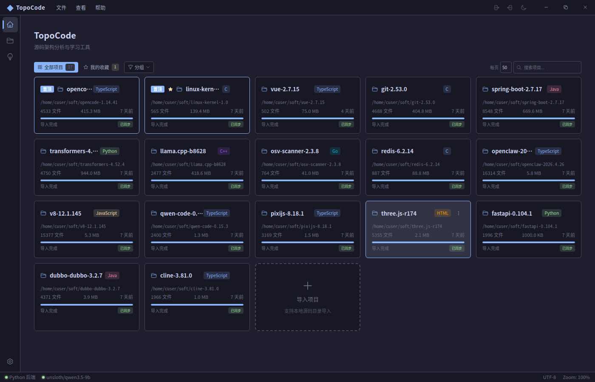

*界面总览：Activity Bar、侧边面板、内容区、状态栏*

### 布局元素

| 区域 | 功能 |
|------|------|
| **Activity Bar** | 左侧导航栏：首页(项目)、代码、分析、知识库、设置 |
| **Top Bar** | 菜单栏 + 主题切换 + 导入按钮 + 缩放 |
| **Left Panel** | 项目列表、文件树 |
| **Content Area** | 各页面主内容（由路由切换） |
| **Right Panel** | AI 助手、代码索引、报告任务列表、调试面板 |
| **Status Bar** | 后端连接状态、AST 就绪状态、Git 分支、AI 模型 |

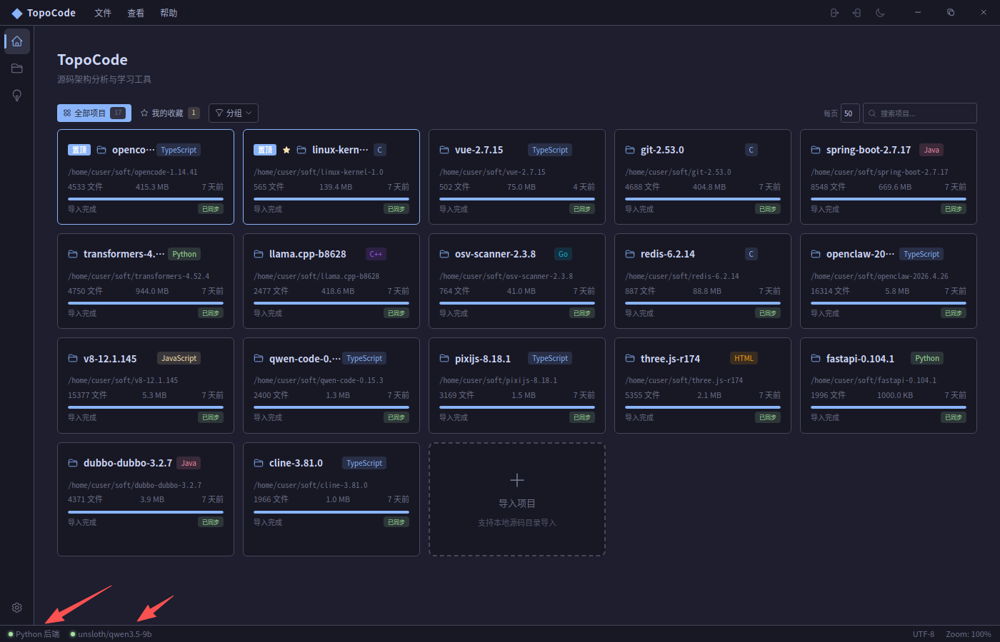

*底部状态栏：后端状态 / AST / Git / 模型 / 编码信息*

### 页面路由

| 路由 | 页面 | 功能 |
|------|------|------|
| `/home` | 项目导入 | 项目管理、分组、文件树、任务创建 |
| `/code` | 代码解析 | 任务创建、文件统计、代码预览 |
| `/analysis` | 代码分析 | 分析报告、社区图谱、AI 分析 |
| `/knowledge` | 知识库 (待开发) | 知识图谱、文档管理、动画播放 |
| `/coder` | AI 助手 (待开发) | 多会话聊天、代码问答 |
| `/user` | 设置 | 模型配置、主题编辑、通用设置 |

---

## 四、项目管理

### 4.1 项目列表

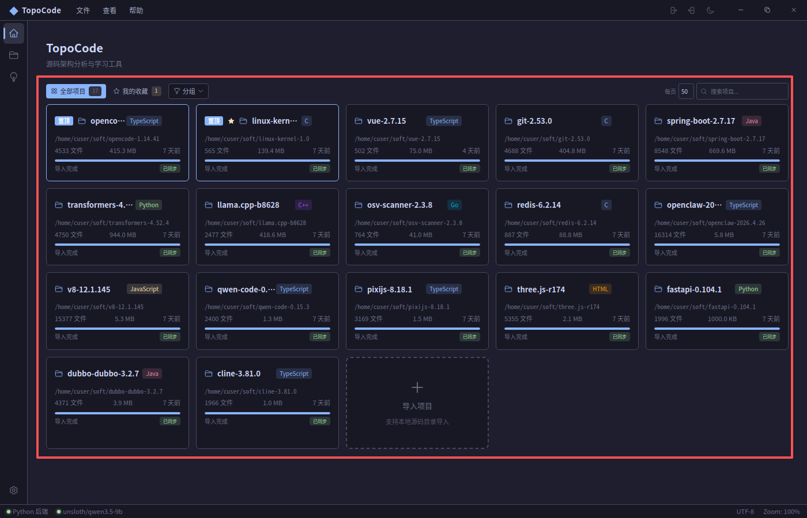

*首页项目列表：卡片网格展示所有导入项目*

登录后首页展示所有已导入项目的卡片网格，支持搜索、分组筛选和收藏筛选。

### 4.2 导入项目

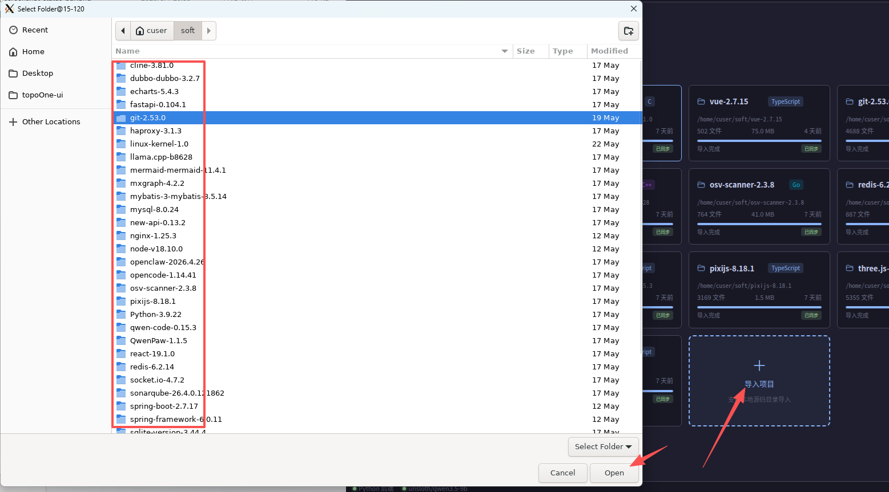

*拖拽导入区：支持文件对话框和拖拽两种方式*

1. 点击 TopBar 的 **导入** 按钮，或使用拖拽到 `ImportZone`
2. 选择本地源码目录
3. 系统自动检测项目语言和文件结构

### 4.3 项目分组管理

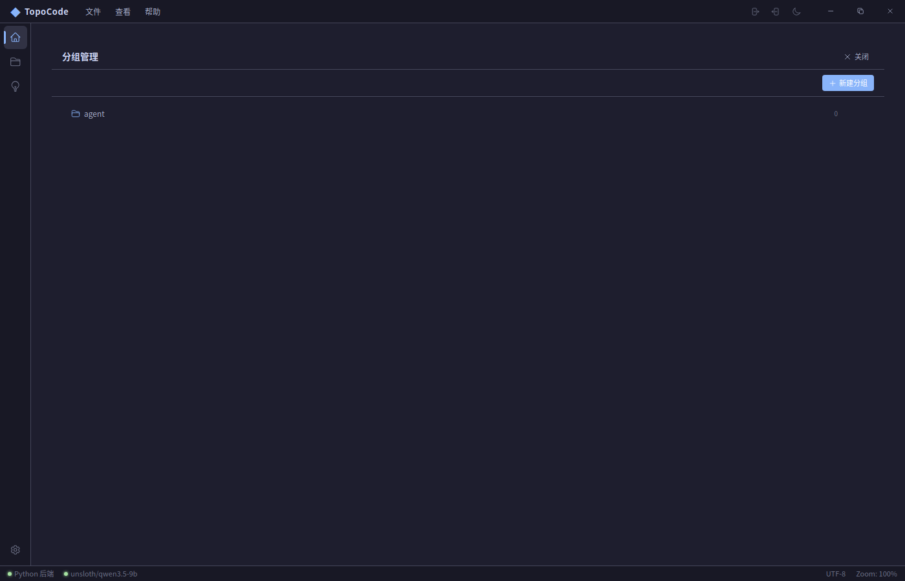

*项目分组 1：分组列表与管理器*

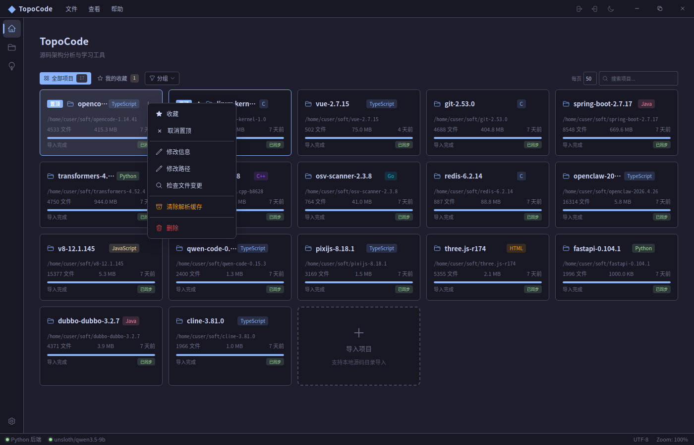

*项目分组 2：拖拽分组操作*

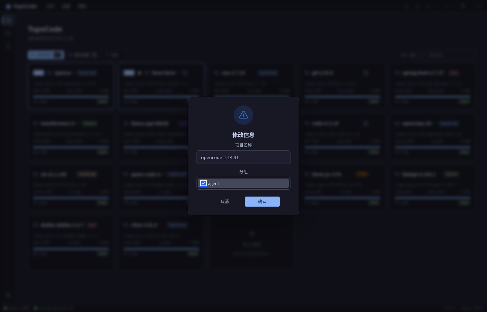

*项目分组 3：分组项目管理*

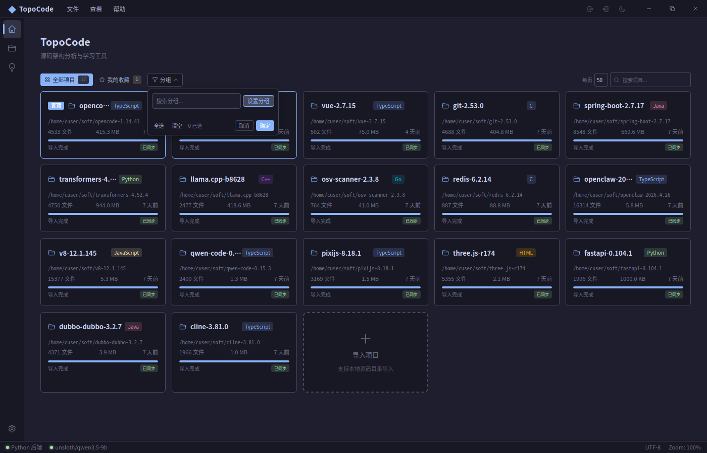

*项目分组 4：完整分组视图*

通过 `GroupManager` 创建树形分组（M:N 关系），便于组织多个项目：

- 创建/编辑/删除分组
- 项目可属于多个分组
- 通过 `GroupFilter` 按分组筛选

### 4.4 文件树浏览

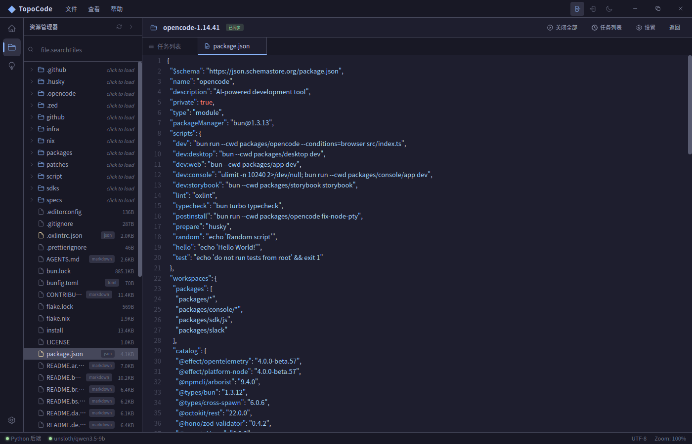

*文件树：展开/折叠、搜索、文件预览*

- **文件树**：左侧面板展示项目文件树，支持懒加载、搜索、筛选
- **代码预览**：点击文件可在 `FilePreview` 中查看高亮代码
- **文件统计**：`FileStatsPanel` 展示各语言行数统计

### 4.5 项目管理操作

| 操作 | 说明 |
|------|------|
| 收藏 | 星标项目，快速访问 |
| 固定 | 固定在列表顶部 |
| 清除缓存 | 选择性清除分析缓存数据 |
| 删除 | 移除项目（不影响源文件） |

---

## 五、代码解析

### 5.1 创建分析任务

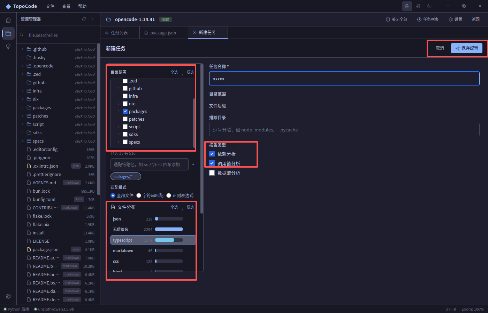

*任务创建表单：选择范围、文件扩展名、排除目录、报告类型*

在 `TaskCreateForm` 中配置：

| 配置项 | 说明 |
|--------|------|
| 范围 | 选择要分析的文件/目录 |
| 扩展名 | 限定文件类型（如 `.py`, `.js`） |
| 排除目录 | 跳过无需分析的目录（如 `node_modules`） |
| 报告类型 | 选择要生成的分析报告类型 |

### 5.2 任务列表

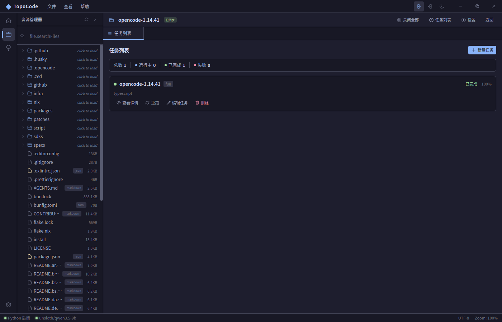

*任务列表：展示所有分析任务及其状态、进度*

### 5.3 分析管道

任务创建后，系统自动执行 **6 步分析管道**：

```
Step 1: AST 解析      → Tree-sitter 解析语法树
Step 2: 符号提取      → 提取函数、类等全局符号
Step 3: 调用图提取    → 函数调用关系分析
Step 4: 依赖图提取    → 模块/文件依赖关系分析
Step 5: 社区发现      → Louvain 算法检测功能模块
Step 6: 结果汇总      → 汇总分析结果
```

### 5.4 任务详情

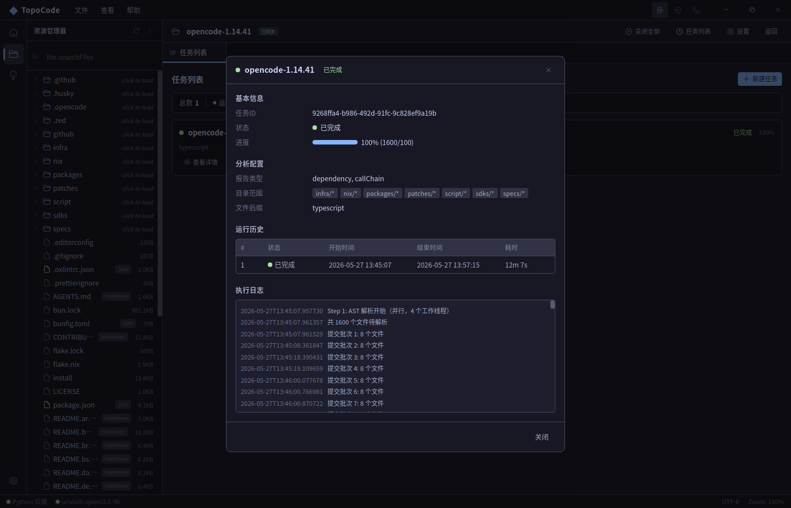

*任务详情：AST 视图、调用链、依赖图、社区结果、执行日志*

任务完成后，可通过 `TaskDetailDialog` 查看：

- **AST 视图**：语法树结构
- **调用链**：函数间调用关系
- **依赖图**：模块/文件依赖关系
- **社区结果**：Louvain 算法划分的功能模块
- **执行日志**：每一步的执行日志

### 5.5 文件统计


*文件统计面板：各语言行数分布、目录树筛选*

---

## 六、代码分析

### 6.1 报告生成管道

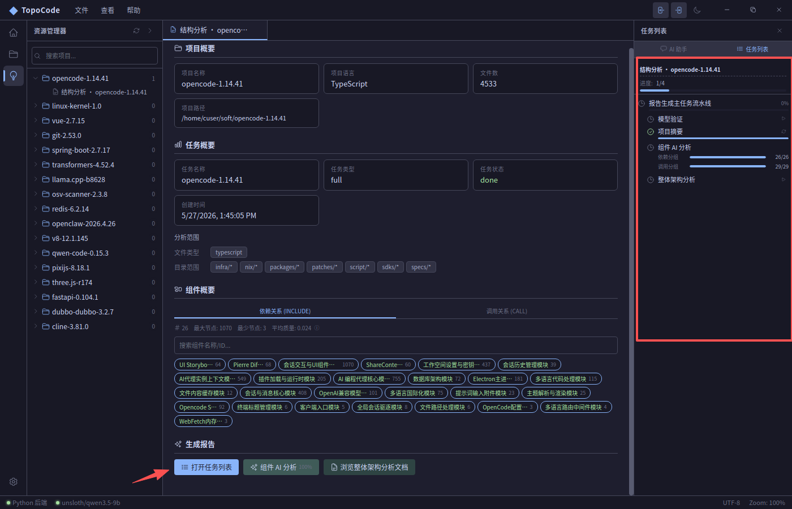

*报告生成管道：多步骤 LLM 驱动的架构分析*

`ReportGenerationPipeline` 提供 LLM 驱动的报告生成：

```
Step 0: 文件摘要预处理  → 提取 README/依赖文件，生成文件摘要
Step 1-5: 架构分析     → LLM 逐层分析架构
社区 AI 分析           → 对每个社区进行 AI 解读
整体架构文档           → 生成全局架构报告
```

### 6.2 社区分析

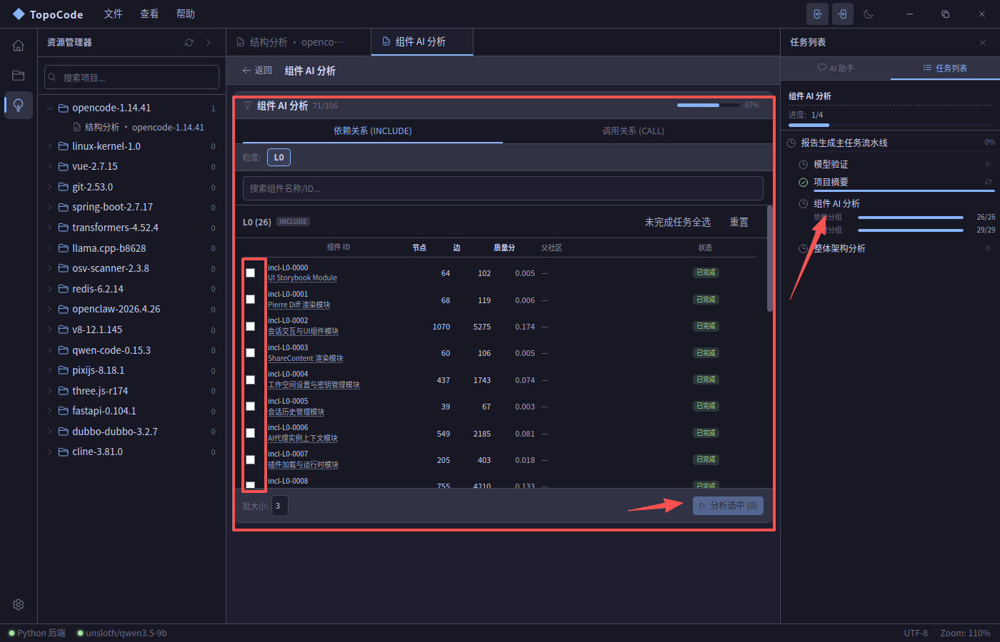

*社区图谱：Louvain 算法划分的功能模块，支持多层级展开*

社区分析基于 Louvain 算法检测代码中的功能模块：

- **多层级**：支持 L0/L1 等多层级社区展开
- **边类型**：支持 `call`（调用）和 `include`（包含）两种关联
- **AI 解读**：选中社区后，LLM 自动生成功能描述和架构说明
- **图表渲染**：为每个社区生成 Mermaid/PlantUML 图

### 6.3 子文档查看

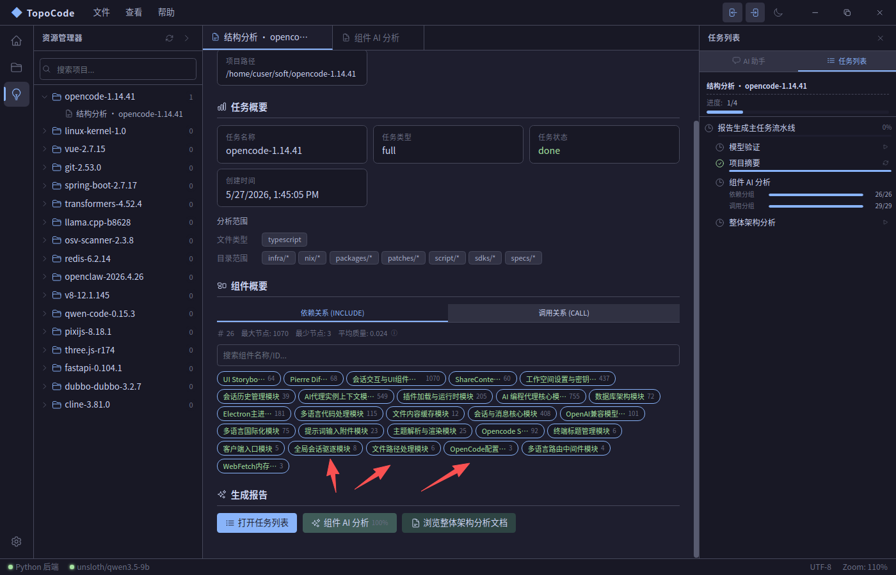

*子文档查看器：Markdown 渲染、Mermaid/PlantUML 内联图表*

`SubDocViewer` 支持：

- Markdown 文档渲染
- Mermaid 图表内联渲染
- PlantUML 图表内联渲染
- 社区链接跳转
- 编辑/保存

### 6.4 Mermaid 图表渲染

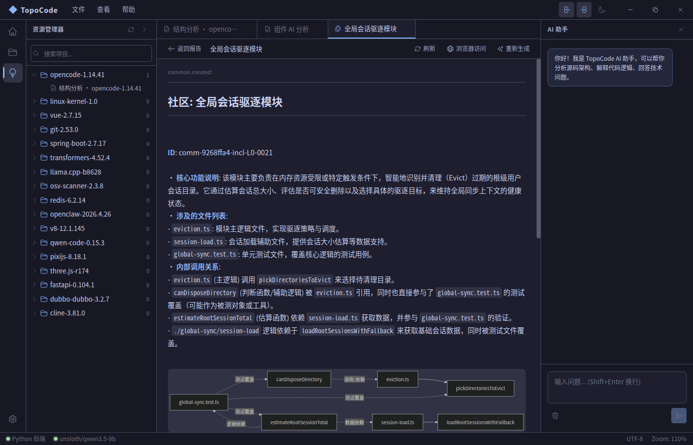

*Mermaid 图表：架构图、流程图内联渲染示例*

### 6.5 浏览器端查看

启动后端后，可通过浏览器访问 `http://localhost:3456` 查看：

- 架构文档
- 社区目录
- 代码查看

---

## 七、AI 助手

> ⚠️ **待开发**：AI 助手功能当前处于待开发状态，尚未在 v0.1.0 beta 中提供。以下为规划功能。

### 7.1 会话管理


*AI 助手：多会话 Tab 栏，消息流式展示*

- **多会话**：创建多个独立对话
- **会话切换**：通过 Tab 栏快速切换
- **会话删除/清空**：管理会话历史

### 7.2 对话界面


*AI 对话：消息气泡、上下文卡片、输入区*

AI 助手提供三种交互模式：

| 模式 | 说明 |
|------|------|
| **聊天 (Chat)** | 自由对话，代码问答 |
| **工具调用 (Tools)** | 调用分析工具（PlantUML 渲染等） |
| **结构化输出** | 按模板生成结构化报告 |

### 7.3 上下文管理

- **上下文卡片**：显示当前分析相关的知识、代码、分析上下文
- **规格卡片**：需求/规范文档上下文
- **任务状态卡片**：LLM 任务执行状态

### 7.4 LLM 配置

AI 助手兼容以下 API：

- Ollama（本地）
- LM Studio（本地）
- OpenAI 兼容 API

首次使用需在设置页面配置模型。

---

## 八、知识库

> ⚠️ **待开发**：知识库功能当前处于待开发状态，尚未在 v0.1.0 beta 中提供。以下为规划功能。

### 8.1 知识图谱


*知识图谱：D3.js 力导向图展示知识关联*

`KnowledgeGraph` 以图形化方式展示知识间的关联：

- D3.js 力导向图
- Mermaid 图视图

### 8.2 知识文档管理


*知识文档：文档卡片、维度标签、收藏/固定*

- **CRUD**：创建、编辑、删除知识文档
- **维度分类**：按生命周期、技术栈、抽象层、用途四维分类
- **收藏/固定**：标记重要文档

### 8.3 分类管理

`CategoryManager` 管理四种维度的分类标签：

| 维度 | 说明 |
|------|------|
| 生命周期 | 需求/设计/开发/测试/部署/运维 |
| 技术栈 | 前端/后端/数据库/基础设施 |
| 抽象层 | 架构/组件/模块/函数 |
| 用途 | 业务/技术/管理/学习 |

### 8.4 TopoScript 动画


*TopoScript 动画播放器：分步教学演示*

内置自定义动画引擎 **TopoScript**，用于教学演示：

- 脚本驱动的动画编排
- 多阶段步骤同步
- SVG/Canvas 双渲染器
- 支持导出为 HTML/图片

---

## 九、设置与配置

### 9.1 模型配置

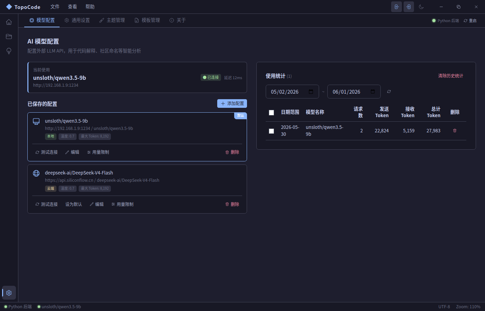

*模型配置：添加、测试、管理 LLM 模型*

| 功能 | 说明 |
|------|------|
| 添加模型 | 配置名称、提供商、API 地址、密钥 |
| 测试连接 | 验证模型是否可达 |
| 默认模型 | 设置 AI 助手的默认模型 |
| 使用统计 | 查看各模型调用情况 |

### 9.2 Agent 与技能 (待开发)

> ⚠️ Agent 与技能功能当前处于待开发状态，尚未在 v0.1.0 beta 中提供。

- **Agent 管理**：添加/删除/检测代理状态
- **技能管理**：启用/禁用分析技能

### 9.3 主题系统


*主题管理器：预设主题列表、自定义主题编辑器*

基于 Catppuccin Mocha 色彩体系：

- **预设主题**：内置暗色/亮色主题
- **自定义主题**：通过 `ThemeEditor` 自由配色
- **导入/导出**：分享自定义主题

### 9.4 通用设置


*通用设置：语言、字体大小、自动保存、端口配置*

| 设置项 | 说明 |
|--------|------|
| 语言 | 中文 / English |
| 字体大小 | 实时生效 |
| 自动保存 | 自动保存间隔 |
| 分页大小 | 项目列表每页数量 |
| ZMQ 端口 | DEALER / PUB 端口配置 |

---

## 十、FAQ

### Q: 支持哪些编程语言？

目前支持 11 种语言：C、C++、C#、Java、JavaScript、TypeScript、Python、Go、Rust、PHP、Swift。更多语言持续扩展中。

### Q: 分析时后端未启动？

确保 Python 后端已启动。Status Bar 右下角显示后端连接状态（绿色=已连接，红色=异常）。

### Q: 如何配置 AI 模型？

进入设置页面 → 模型配置 → 添加模型。推荐使用 Ollama 或兼容 OpenAI API 的服务。

### Q: 分析报告如何导出？

报告生成后可通过 `SubDocViewer` 查看，也可通过浏览器访问 `http://localhost:3456` 查看在线版本。

### Q: 如何清除分析缓存？

在项目卡片上点击右键 → 清除缓存，可选择按表清除（base_node、graph_node 等）。

### Q: 报告支持导出 PDF 吗？

当前不直接支持 PDF 导出。可通过浏览器查看后，使用浏览器打印功能另存为 PDF。

---

> **遇到问题？** 请访问 [GitHub Issues](https://github.com/topocode/topoone-ui/issues) 提交反馈。
